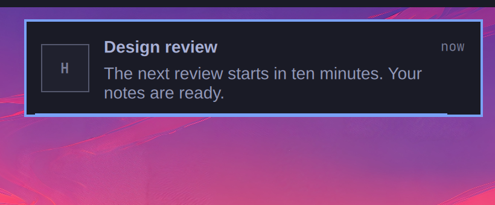
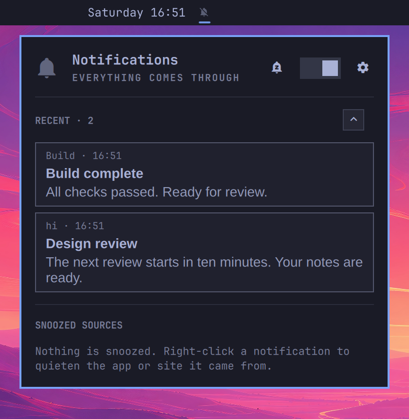

> **Unreleased hardening branch:** based on upstream commit
> `29548e5761f1b9f419afe988d77f67e3dd3e81cb`. See
> [upstream handoff](docs/UPSTREAM_HANDOFF.md) for the implementation and review
> notes. Bubblewrap is required for helpers; remote icons and implicit sender
> default actions are off by default. History defaults to 24 hours/100 entries,
> and detected-code notifications are stored as redacted placeholders.
> This branch is a draft review proposal and has not passed live integration testing.
> The original feature documentation below describes the upstream UX; the
> [security architecture](docs/SECURITY_ARCHITECTURE.md) overrides conflicting
> security/default-behavior statements. Use reviewed commits for installation,
> and complete disposable-session integration checks before enabling this branch.


<!--
 ▄█████▄    ▄███████████▄   ▄███████   ▄███████▄  ▄███████    ▄█████▄   ▄████████  ▄███████▄
███   ███  ███   ███   ███  ███   ███  ███   ███  ███   ███  ███   ███  ███   ███  ███   ███
███   ███  ███   ███   ███  ███   ███  ███   ███  ███   ███  ███        ███   ███  ███   ███
███   ███  ███   ███   ███  ███▄▄▄███  ███▄▄▄███  ███▄▄▄███  ███ ▄▄▄▄▄  ███▄▄▄     ███▄▄▄██▀
███   ███  ███   ███   ███  ███▀▀▀███  ███▀▀▀▀▀▀  ███▀▀▀███  ███ ▀▀███  ███▀▀▀     ███▀▀▀██▄
███   ███  ███   ███   ███  ███   ███  ███        ███   ███  ███   ███  ███   ███  ███   ███
███   ███  ███   ███   ███  ███   ███  ███        ███   ███  ███   ███  ███   ███  ███   ███
 ▀█████▀    ▀█   ███   █▀   ███   █▀    ▀█        ███   █▀    ▀█████▀    ▀███████   ███   █▀
-->

A notification daemon for [Omarchy](https://omarchy.org). It replaces the
built-in notification service with a stacking deck that groups by source,
reads what a notification is actually offering you, and lets you act on it
without leaving the card.



## What it does

**Stacks and groups.** Notifications from the same source collect into one
deck. Hovering expands it. Nothing is hidden behind a "3 more" summary —
every notification is a real card you can act on.

**Uses the shell's visual language.** Cards use Omarchy's notification palette,
380px width, outer gaps, border specs and theme-controlled corners, without
additional drop shadows. Message text follows the stock card's Liberation Sans
typography; controls and metadata use the system font. Shared buttons, fields,
panel headers and cursor surfaces honour the theme's control tokens, including
gradient and per-side borders. Grouping, the sender fallback mark, action offers
and inline replies remain omapager features rather than copies of the simpler
stock card.

A body is held to two lines while you are scanning a deck, and opens to its
full length — up to eight lines — once the deck is expanded, or on hover when
it is the only card on screen. Phone messages are why: a sentence and a half
arriving as a sentence and an ellipsis is the commonest way to lose the point
of a message.

**Reads the contents.** A verification code, a link or a phone number in the
body becomes a labelled button: `Copy code`, `Open link`, `Copy number`. A mark
on the headline tells you a card is
carrying something before you hover, because the useful part of a message is
usually past the ellipsis.


A message carrying two codes gets a button each, labelled with the digits,
because "Copy code" twice is a coin toss. Detection is deliberately
conservative: `412 passed, 0 failed` is not a code, and neither is
`Claude Code build 1841`.

**Shows the sender's own actions.** The freedesktop spec has carried actions
all along; most desktops draw none of them. Reply, Mark as read, whatever the
app offered, appear as buttons on hover.


**Replies to your phone.** Phone notifications reach the desktop through KDE
Connect, and the ones carrying a reply channel grow a text field on the card.
The answer goes back to the conversation, and the notification is dismissed on
the phone too. Nothing new lands and nothing expires while you are typing, so
the field cannot move out from under you mid-sentence.


**Sends you back where it came from.** Clicking a card focuses the window that
source is already showing in — a Slack notification lands in the Chrome you
already have Slack open in, rather than a new tab — and opens something new
only when there is nothing to go back to. It can only see the tab a browser is
actually showing, so a site sitting in a background tab opens fresh.

**Quietens one source at a time.** Right-click a card and pick how long. It is
the *source* that goes quiet, not the app that relayed it: snoozing a Slack
notification that arrived through Chrome silences `app.slack.com` and nothing
else, and snoozing a noisy shopping app on your phone leaves WhatsApp alone.
Snoozed notifications are still recorded — they go to history without ever
being on screen.

The panel does the same for everything at once. Both offer the lengths in
`snoozeDurations`, which are yours to change.

**Lets the code through anyway.** A snooze or a silence holds everything back
except a notification carrying a verification code. You asked for that code
thirty seconds ago and it expires in five minutes — and being locked out of a
login because you had quietened Slack is exactly the failure that makes people
stop snoozing anything. The key beside the panel's snooze button closes the
hole for the times you want nothing at all. Copying a code dismisses its
notification; there is nothing left in it afterwards.

**Shows you what quiet cost.** Silence is only tolerable if you can see what it
kept from you. While anything is being held back, the panel lists the sources
that caught something and opens each one to show what it caught, newest first —
capped at both ends, so a fortnight of silence doesn't turn a panel into a log
file.

**Keeps the notification you just missed.** The panel's Recent stack shows the
newest notifications even while notifications are enabled, after their toasts
expire or are dismissed. Right-click the bar indicator to read them; hover the
centre of the bar to reveal it when nothing is held back. Cards show the source,
arrival time, title and a two-line text preview, with no actions or replay.
Recent starts collapsed, showing only its count. Click the heading or chevron to
reveal the cards; closing and reopening the panel collapses it again. New
notifications update the count without opening the list.

`recentCount` chooses how many cards to show: **1–20, default 5**. The latest 20
text snapshots stay in memory for this shell session only, and replacing a live
notification updates its entry rather than duplicating it. Restarting the shell
clears Recent; it does not load or alter the existing disk history. Verification
notifications use the same redacted placeholder as history, not the code.

Recent is hidden while everything is snoozed or silenced. Snoozed sources are
excluded before applying the card limit, so other sources can still fill it.
Notifications received during a snooze or silence belong only in Held Back;
they do not populate Recent when quiet ends. A source's earlier recent entries
are hidden while it is snoozed and become eligible again when it wakes.



**Resolves real icons.** Your own icon themes win; web notifications fall back
to the site's own icon, in dark and light variants to suit the theme.

## Install

```bash
git clone https://github.com/njpatel/omapager.git \
  ~/.config/omarchy/plugins/njpatel.omapager
```

Then in `~/.config/omarchy/shell.json`, turn off the built-in service, add the
plugin, and put the indicator in the bar beside the other status glyphs, since
it behaves like one:

```json
{
  "disabledPlugins": ["omarchy.notifications"],
  "plugins": [{ "id": "njpatel.omapager" }],
  "bar": { "layout": { "center": ["omarchy.indicators", "njpatel.omapager", "omarchy.clock"] } }
}
```

`omarchy-restart-shell` to pick it up. (Not `omarchy-refresh-shell` — that
resets `shell.json` to defaults.)

### Removing it

```bash
omarchy plugin remove njpatel.omapager
```

Then undo the three lines above: take `omarchy.notifications` back out of
`disabledPlugins` so the built-in service can claim the bus again, and drop
`njpatel.omapager` from the bar layout. `omarchy-restart-shell` to apply.

State is left behind on purpose, in case you are only reinstalling —
`rm -rf ~/.local/state/omarchy/omapager` clears the history and the resolved
icons for good.

## Settings

Omapager's behavior options live in its bar-widget entry in
`~/.config/omarchy/shell.json`. Appearance also comes from Omarchy's shared theme
and desktop settings; those are described separately under
[Appearance inherited from Omarchy](#appearance-inherited-from-omarchy).

### Omapager options

Open the notification panel and click the cog for preferences. In the native
**Show notifications on** dropdown, **Active display** places a fresh deck on
Hyprland's focused monitor. A visible deck stays put when focus moves.
**Only DP-1**, for example, pins notifications to that output; disconnected selections are
retained, with a connected-display fallback until the output returns.
**All displays** shows the same deck everywhere. Dismissal and snoozing remain shared.

The dropdown, number field, switch, header and separator reuse Omarchy's UI
components rather than defining a separate control style.
Use arrows or `j`/`k` in the dropdown, Enter to choose and Escape to close the menu.

**Edge spacing (px)** sets the distance from the bar and screen edges for both
notification cards and the settings/history panel. It defaults to **12 logical
pixels**, accepts 0–64, and applies immediately. Notifications remain top-right,
clearing the bar only when it occupies the top or right edge. Internal padding
and the spacing between cards are unchanged.

**Show countdown animation** is off by default. Enable it to show a shrinking
time-remaining line along the bottom of notifications. This changes only the
visual timer; notifications still expire normally when it is disabled.

The in-panel preferences expose display selection, edge spacing, countdown
animation and sharing offers. They save to the same bar-widget entry and persist
across shell restarts. The other options below can be set on that entry too;
there is no second user configuration file to maintain. Defaults are for a fresh
configuration, not a reset of choices you have already saved.

| key | default | what it does |
| --- | --- | --- |
| `stacking` | `source` | `source` gives each sender its own deck; `all` puts everything in one |
| `displayMode` | `active` | `active` follows focus for each fresh deck; `specific` uses `displayName`; `all` mirrors notifications |
| `displayName` | empty | output name for `specific`, such as `DP-1`; retained while disconnected |
| `edgeSpacing` | `12` | distance from the bar and screen edges in logical pixels (0–64), for notification cards and the panel |
| `showCountdown` | `false` | opt in to the animated time-remaining line; does not change notification expiry |
| `offerSnoozeWhenSharing` | `true` | offer a timed snooze when a Hyprland portal sharing session is detected; never mute automatically |
| `fontScale` | `100` | notification font size as a percentage of the theme (75–200); scales card text, actions and inline replies, leaving the bar and panel unchanged |
| `actionsAlign` | `right` | `right` or `left` alignment for the card's action buttons |
| `hideSettingsAction` | `true` | hide the browser's repeated Settings action on notification cards |
| `snoozeDurations` | `30, 60, 240, tomorrow` | offered snooze lengths: `15`, `30`, `60`, `120`, `240`, `480` minutes or `tomorrow`; an empty selection uses the defaults |
| `wakeHour` | `8` | wake hour for `tomorrow`, on a 24-hour clock (0–23); currently `0` falls back to `8` |
| `smartRaise` | `true` | match a site against browser window titles, so a click lands in the window already showing it |
| `alwaysShow` | `false` | keep the bar slot even when nothing is held back, so the centre of the bar never shifts |
| `codesBypassQuiet` | `true` | let a notification carrying a verification code through a snooze or a silence |
| `timeFormat` | `system` | `system` follows `LC_TIME`; `24h` and `12h` pin it |
| `sourceLimit` | `8` | number of quietened sources listed in the panel; settings range 2–20 |
| `heldPerSource` | `10` | held notifications shown per source; settings range 3–25 |
| `recentCount` | `5` | recent notifications shown in the panel (1–20), including when notifications are enabled; resets on shell restart |
| `fetchRemoteIcons` | `false` | opt in to website-icon requests; reveals your IP and approximate notification time to the source website, and requires Bubblewrap and Pillow; local/cached icons remain available when off |
| `allowDefaultActionOnCardClick` | `false` | allow the sender's default action on a card click; when off, card clicks use known-window focus or a validated source URL, while explicit action buttons remain available |
| `historyHours` | `24` | disk-history retention: `0` disables history, otherwise `1`, `24` or `168` hours; capped at 100 entries |
| `clipboardTimeout` | `60` | clear a copied verification code after `30`, `60` or `90` seconds, only if the clipboard still contains that code |

`fontScale` adjusts notification content, actions and inline replies from
75–200% while the bar and panel keep their usual size. Long titles wrap;
actions that do not fit move behind **More**, where long labels wrap in
full-width buttons rather than being clipped.

Disk history is trimmed by age and count: **24 hours or 100 entries** by default,
whichever limit is reached first. `historyHours` changes the age limit or disables
history; Recent remains a separate in-memory list. Resolved icons are dropped
after 60 days unused.

Merge options into the existing bar-widget entry in `shell.json`, alongside `id`.
For example, this is a widget entry, **not a complete replacement for shell.json**:

```json
{
  "id": "njpatel.omapager",
  "edgeSpacing": 12,
  "showCountdown": false,
  "fontScale": 100,
  "historyHours": 24
}
```

### Appearance inherited from Omarchy

These are **Omarchy-wide values, not additional Omapager options**. Omapager reads
the shared `Color`, `Style` and `Border` components; it does not maintain its own
copy of the theme. Omarchy merges the active theme's `shell.toml` with
`~/.config/omarchy/shell.toml`, with user values taking precedence. Put persistent
theme overrides in the latter, not in Omapager's `shell.json` entry or the
generated active-theme files.

| Appearance | Source |
| --- | --- |
| Card colors | Omarchy's `[notifications]` background, text, border and countdown roles; critical notifications also use the shared urgent color |
| Card border width | `[notifications] border-width`, with optional `border-width-top/right/bottom/left` overrides; otherwise `max(1, Style.space(2))`, exactly as in stock notifications—2 logical pixels at the default scale |
| Panel surface and border | The shared `KeyboardPanel` uses Omarchy's `[popups]` colors and border settings |
| Corner rounding | `Style.cornerRadius`, which follows Hyprland's `decoration:rounding` |
| Typography | Omarchy's `[font]` size tokens; action buttons, timestamps and replies use the shared UI font, and the panel uses the bar's font. Notification titles and body text use Liberation Sans, matching the stock card. Omapager's `fontScale` multiplies card text sizes only |
| Button, switch and dropdown states | Native Omarchy controls use the shared `[controls]` fill, border, hover, pressed and focus tokens |
| Internal spacing and padding | `Style.space(...)` and `Style.spacing` follow Omarchy's `[spacing]` settings, including font-linked scaling; the panel inherits the shared popup padding |
| Bar clearance and panel orientation | The live Omarchy bar supplies its position, thickness and visibility; Omapager adds bar thickness only to the top/right notification edge that needs clearing, and `KeyboardPanel` positions the panel beside its bar icon |

For example, to set the card border width explicitly, add or update this section
in **`~/.config/omarchy/shell.toml`**:

```toml
[notifications]
border-width = 2
```

That changes every component using Omarchy's notification border tokens, not just
Omapager. The panel border uses `[popups]` instead. There is currently no separate
Omapager border-width option.

**Edge spacing is an explicit exception.** `edgeSpacing` replaces the shared
`Style.gapsOut` distance for the notification deck and the panel's bar gap and
screen margin. Its default is 12 logical pixels, independent of theme spacing
scale and Hyprland's `general:gaps_out`.

Other geometry is fixed in Omapager but scaled through `Style.space`: the card's
base width is 380, the expanded-card gap is 6, and the gap between source decks is 11.
These are not plugin options. At 2× display scaling, 12 logical pixels occupy
24 physical pixels; display scaling does not change the configured value.

### Sharing offers

When the Hyprland screen-sharing portal creates a screen, window or area stream,
the bar shows a sharing indicator. Click it to choose **30 minutes**, **1 hour**,
**4 hours**, or **Not now**. No notification toast or panel opens automatically,
and notifications continue until you choose a snooze. The ordinary snooze rules
still apply, including critical alerts and the configured verification-code exception.

An offer is handled once until all detected streams end. Additional simultaneous
streams do not repeat it. If DND or a global snooze is already active, no offer is
shown for that sharing period. A chosen snooze keeps its timer regardless of when
sharing ends: it can outlast a short share or expire during a long one.

Detection reads current PipeWire video-node metadata, including streams already
present at shell startup. It recognises the Hyprland portal's `xdph-streaming-`
media names, not arbitrary video sources or compositor capture events. Direct
VNC captures, screenshots and applications that bypass that portal do not trigger
it; portal-based recording can. This is a convenience, not a privacy guarantee.
Only 64 video-source nodes are tracked. Dismissal is in memory, so restarting the
shell during a share can offer again. Disable the offer in settings or set
`offerSnoozeWhenSharing` to `false` in the same widget config entry.

## The bar

omapager takes a slot in the bar while notifications are held back or a sharing
offer is waiting. Hovering the centre of the bar reveals it otherwise, the way
Omarchy reveals its own inactive indicators — that is the way back into silence
when nothing is showing.

| | |
| --- | --- |
| crossed-out bell, in the theme's urgent colour | silenced |
| bell with a `z` in it, in the theme's accent colour | snoozed — everything, or a source |
| monitor-share icon, in the theme's accent colour | sharing detected; click for a snooze offer, without toggling DND |
| crossed-out bell, dimmed | nothing held back |

The icon shapes distinguish quiet states without inventing another palette:
urgent for silencing, accent for snoozes and sharing offers. The theme owns both.

**Left-click** silences and unsilences. **Right-click** opens the panel: the
switch, a button beside it that snoozes everything for a while, the Recent
stack, and what is being kept from you — when each source comes back, how much
it has caught, and the messages themselves when you open one.

## Keybindings

Omarchy's five stock bindings on the comma key keep working unchanged.
omapager answers the same IPC target the built-in service did, so there is
nothing to rebind and nothing to configure:

| | |
| --- | --- |
| `SUPER` `,` | dismiss the newest notification |
| `SUPER` `SHIFT` `,` | dismiss all of them |
| `SUPER` `CTRL` `,` | toggle silencing |
| `SUPER` `ALT` `,` | invoke the newest one, as clicking it would |
| `SUPER` `SHIFT` `ALT` `,` | put the last few back on screen |

### Worth adding

Three things the stock bindings have no key for. All three are free on a stock
install — check yours with `omarchy menu keybindings --print`, and `hl.unbind`
first if you have moved things around.

In `~/.config/hypr/bindings.lua`:

```lua
-- Copy a code without touching the mouse. The notification takes itself away.
o.bind("SUPER + ALT + C", "Copy code from newest notification",
       "omarchy-shell omapager offer code")

-- Next to SUPER + CTRL + comma, which silences. Quiet for an hour, rather
-- than quiet until you remember you turned it off.
o.bind("SUPER + CTRL + ALT + comma", "Snooze all notifications for an hour",
       "omarchy-shell omapager snoozeAll 60")

-- What is snoozed, what it has held, and the way back. Worth a key: the bar
-- icon is not there at all when nothing is being held back.
o.bind("SUPER + CTRL + SHIFT + comma", "Notification options",
       "omarchy-shell omapager.panel toggle")
```

## Driving it from a script

```
omarchy-shell omapager count            how many are on screen
omarchy-shell omapager clear            dismiss them
omarchy-shell omapager dnd              toggle Do Not Disturb
omarchy-shell omapager expand           open the deck, as hovering would
omarchy-shell omapager offer code       take the front card's offer (code|link|phone)
omarchy-shell omapager act reply        invoke one of the sender's actions
omarchy-shell omapager reply "text"     answer the front card ("" opens the field)
omarchy-shell omapager snooze 60        quieten the front card's source, in minutes
omarchy-shell omapager snoozeAll 60     quieten everything for 60 minutes, or wake it
omarchy-shell omapager codes off        stop letting verification codes through
omarchy-shell omapager unsnooze ""      wake everything ("" for all, or a source key)
omarchy-shell omapager snoozes          what is snoozed, and until when
omarchy-shell omapager stack source     switch stacking mode
omarchy-shell omapager align right      switch which end the buttons sit at
omarchy-shell omapager probe            what the daemon believes, as JSON

omarchy-shell omapager.panel toggle     the panel
omarchy-shell omapager.panel expand x   open a source's held list, as clicking it would
omarchy-shell omapager.panel openSettings  display, edge-spacing and sharing-offer settings
```

## Seeing it work

```bash
bin/omapager-demo                       # the everyday scenes
bin/omapager-demo --scene interactive   # codes, links, and the sender's buttons
bin/omapager-demo --scene routing       # where a click sends you, per source
bin/omapager-demo --scene reply --keep --timeout 30000  # local inline-reply demo
bin/omapager-demo --replay 40           # your own notifications, re-sent
bin/omapager-demo --list
```

`--scene routing` reads your open windows and prints what each card *should*
do before it sends anything, so you can check it against what happens.
`--scene reply` creates an **Omapager reply demo** notification. Hover it, choose
**Reply**, type and press Enter. No phone or special shell environment is needed;
the reply is saved locally, never sent to a person.

The synthetic session and latest reply are stored as `notification.json` and
`reply.json` under `~/.local/state/omarchy/omapager/reply-demo/`. Only demo requests
expose that directory to the helper sandbox; real notification state stays hidden.
Each run replaces the session, and sessions expire after 30 minutes. Demo fixtures
cannot stand in for another app, and an older session cannot accept a new reply.

## Requirements

Omarchy (Quickshell 0.3.x, Hyprland), and Python 3 for the helpers in `bin/`.

Two more things are worth having, and they are not the same kind of thing.

**`wl-clipboard` — recommended.** Not an Omarchy dependency, so check before you
assume it: `command -v wl-copy`. The copy buttons work either way, but with it a
copied verification code is marked sensitive and Omarchy's clipboard history
skips it. The code is cleared after `clipboardTimeout` seconds (60 by default),
unless you have copied something else since—that stays.

**KDE Connect — the whole phone half.** Without it there are no phone
notifications at all: it is the bridge that puts them on the bus in the first
place, so the reply field, `Mark as read` and the grouping by the app a message
really came from all go with it.

```bash
sudo pacman -S wl-clipboard kdeconnect   # kdeconnect also needs the phone app
```

## Contributing

See [how we review contributions](docs/DEVELOPING.md#how-we-review-contributions)
and the [development guide](docs/DEVELOPING.md) for working on omapager.

## Licence

Apache-2.0.
