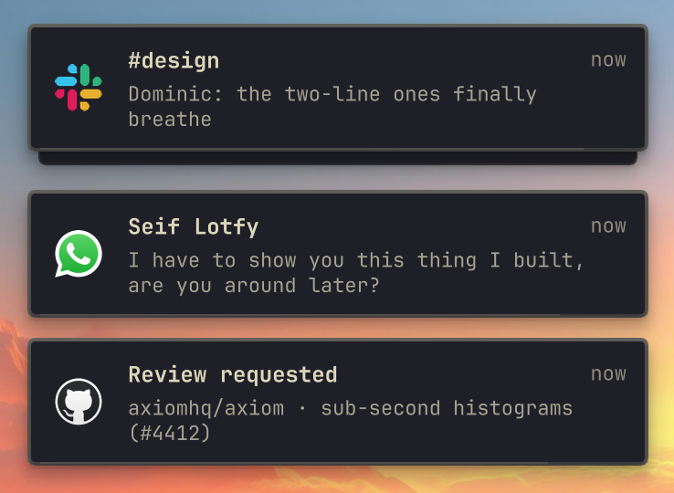
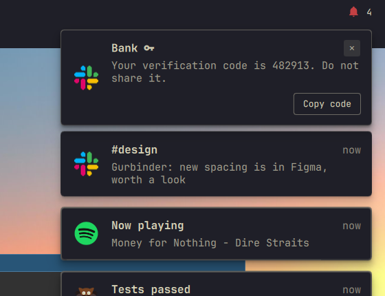
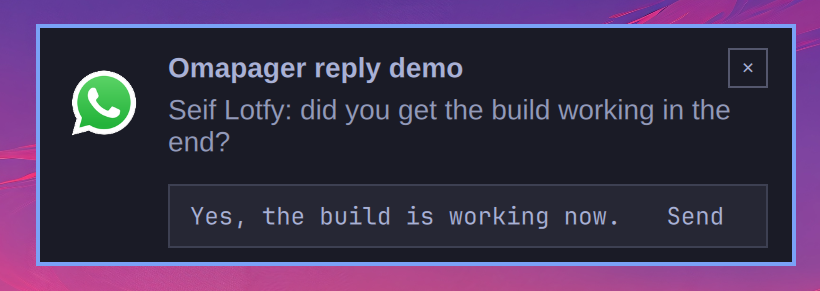
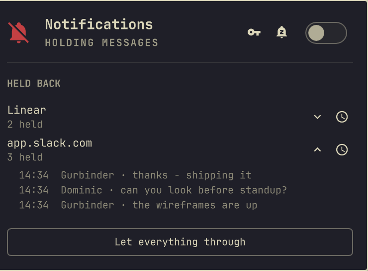

# omapager

A notification daemon for [Omarchy](https://omarchy.org). It replaces the
built-in notification service with a stacking deck that groups by source,
reads what a notification is actually offering you, and lets you act on it
without leaving the card.



## What it does

**Stacks and groups.** Notifications from the same source collect into one
deck. Hovering expands it. Nothing is hidden behind a "3 more" summary —
every notification is a real card you can act on.

**Reads the contents.** A verification code, a link, a phone number or a file
path in the body becomes a labelled button: `Copy code`, `Open link`,
`Copy number`, `Open file`. A mark on the headline tells you a card is
carrying something before you hover, because the useful part of a message is
usually past the ellipsis.



A message carrying two codes — "your code is 482913, your backup code is
771204" — gets a button each, labelled with the digits, because "Copy code"
twice is a coin toss. Copying one of those leaves the card alone; the other one
is still in there.

Detection is deliberately conservative — a rule that fires wrongly is worse
than one that doesn't fire. A code needs a keyword (*code*, *OTP*,
*verification*, *passcode*, *2FA*) **near** a plausible shape, so
`412 passed, 0 failed` stays silent, and so does `Claude Code build 1841`,
where the word is half a product name.

**Shows the sender's own actions.** The freedesktop spec has carried actions
all along; most desktops draw none of them. Reply, Mark as read, whatever the
app offered, appear as buttons on hover.

**Replies to your phone.** KDE Connect keeps a reply channel for the
notifications that have one. When it does, the card grows a text field and the
answer goes back to the conversation on the device — and the notification is
dismissed on the phone too, because you have dealt with it. Escape puts the
buttons back; while you are typing, nothing new lands on the deck and nothing
already on it expires, so the field cannot move out from under you mid-sentence.



**Sends you back where it came from.** Clicking a card runs the sender's
default action; failing that it focuses the window that source is already
showing in, and only opens something new if there's nothing to go back to.
Omarchy's web apps carry their host in their Hyprland class, so those match
outright; a site open as a tab in an ordinary browser doesn't, so the brand is
matched against browser window titles instead — a Slack notification lands in
the Chrome that's already showing Slack rather than in a new tab. That second
rule can only see the window's *title*, which is the active tab: with Slack
sitting in a background tab there is nothing to match, and the site opens
instead. `smartRaise` turns the rule off if you would rather it never guessed.

**Quietens one source at a time.** Right-click a card and pick how long. It is
the *source* that goes quiet, not the app that relayed it — so snoozing a Slack
notification that arrived through Chrome silences `app.slack.com`, not every
website you have open. The same holds for a phone: KDE Connect forwards
everything as one app, so omapager groups by the app it *came from* — snoozing
a noisy shopping app leaves WhatsApp alone. Snoozed notifications are still
recorded; they go to history without ever being on screen.

The lengths on offer are yours: 30 minutes, an hour, 4 hours and until tomorrow
morning by default, and whatever you like in `snoozeDurations` — half an hour is
the useful unit on some desktops and half a day on others. The panel snoozes
*everything* for the same lengths, which is usually the one you want: not for
the next hour, rather than not until you remember you turned it off.

**Lets the code through anyway.** A snooze or a silence holds everything back
except a notification carrying a verification code. You asked for that code
thirty seconds ago and it expires in five minutes, so "I'll look at it later"
is not a thing you can do with it — and being locked out of your own login
because you'd quietened Slack is exactly the failure that makes people stop
snoozing anything. Codes are only ever detected from a keyword sitting next to
a plausible shape, so this is a narrow hole rather than an exception anything
can walk through — and the key beside the panel's snooze button closes it, for
the times you would rather nothing at all came through. Copying the code
dismisses the notification, because a code notification exists to carry six
digits to a login box and there is nothing left in it afterwards.

**Shows you what quiet cost.** Silence is only tolerable if you can see what it
kept from you. While anything is being held back — silenced, snoozed wholesale,
or one source at a time — the panel lists the sources that caught something and
opens each one to show what it caught, newest first. Both ends are capped
(`sourceLimit`, `heldPerSource`) so a fortnight of silence doesn't turn a panel
into a log file.



**Resolves real icons.** Local icon themes first, so your own overrides win,
then the site's own icon for web notifications, with dark and light variants.
A one-colour glyph is redrawn in the theme's text colour so it doesn't
disappear into a dark card.

## Install

```bash
git clone https://github.com/njpatel/omapager.git \
  ~/.config/omarchy/plugins/njpatel.omapager
```

Then in `~/.config/omarchy/shell.json`, turn off the built-in service, add the
plugin, and put the indicator in the bar — beside the other status glyphs in
the centre is where it belongs, since it behaves like one:

```json
{
  "disabledPlugins": ["omarchy.notifications"],
  "plugins": [{ "id": "njpatel.omapager" }],
  "bar": { "layout": { "center": ["omarchy.indicators", "njpatel.omapager", "omarchy.clock"] } }
}
```

`omarchy-restart-shell` to pick it up. (Not `omarchy-refresh-shell` — that
resets `shell.json` to defaults.)

## Settings

| key | default | what it does |
| --- | --- | --- |
| `stacking` | `source` | `source` gives each sender its own deck; `all` puts everything in one |
| `actionsAlign` | `right` | which end of a card its buttons sit at |
| `hideSettingsAction` | `true` | drop the browser's "Settings" button, which is on every web notification and is never the one you wanted |
| `snoozeDurations` | `30, 60, 240, tomorrow` | what the snooze menus offer — minutes, or `tomorrow` |
| `wakeHour` | `8` | the hour "until tomorrow" wakes a source at |
| `smartRaise` | `true` | match a site against browser window titles, so a click lands in the window already showing it |
| `alwaysShow` | `false` | keep the bar slot even when nothing is held back, so the centre of the bar never shifts |
| `codesBypassQuiet` | `true` | let a notification carrying a verification code through a snooze or a silence |
| `timeFormat` | `system` | `system` follows `LC_TIME`; `24h` and `12h` pin it |
| `sourceLimit` | `8` | how many quietened sources the panel lists |
| `heldPerSource` | `10` | how many held notifications it shows per source |

Settings live on the bar widget's entry in `shell.json`, and it hands them to
the daemon — so they are all set in the one place, next to `id`:

```json
{ "id": "njpatel.omapager", "snoozeDurations": ["60", "480"], "wakeHour": 9 }
```

## The bar

omapager takes a slot in the bar only while it is keeping something from you,
and nothing at all the rest of the time. Hovering the centre of the bar reveals
it the way it reveals Omarchy's own inactive indicators — that's the way back
into silence when nothing is showing.

| | |
| --- | --- |
| crossed-out bell, in the theme's urgent colour | silenced |
| bell with a `z` in it, in amber | snoozed — everything, or a source |
| crossed-out bell, dimmed | nothing held back; only visible while the bar's indicators are revealed |

The crossed-out bell is the glyph Omarchy's own DND indicator uses, so a
silenced desktop looks the same whichever service is running. The colour is an
addition: silence is a state you can forget you're in, and the cost of
forgetting is a missed message. Amber rather than red for a snooze, because a
snooze ends by itself.

Left-click silences and unsilences — the fastest thing anyone wants from a
notification indicator is for it to stop, and then for it to start again — so
that is the plain click.

Right-click opens the panel: the switch (on means notifications are coming
through), a button beside it that snoozes everything for a while, and the list
of what is being kept from you — when each source comes back, how much it has
caught, and the messages themselves when you open one.

## Keybindings

Omarchy ships five global bindings on the comma key, and every one of them
talks to the IPC target `notifications`. Disabling the built-in service to run
this one takes that target away with it, so all five go quietly dead: the keys
still fire, the shell answers "target not found", and nothing says why.

So omapager answers to that target as well, and they keep working unchanged —
no rebinding, nothing to configure:

| | |
| --- | --- |
| `SUPER` `,` | dismiss the newest notification |
| `SUPER` `SHIFT` `,` | dismiss all of them |
| `SUPER` `CTRL` `,` | toggle silencing |
| `SUPER` `ALT` `,` | invoke the newest one, as clicking it would |
| `SUPER` `SHIFT` `ALT` `,` | put the last few back on screen |

### Worth adding

Three things omapager can do that the stock bindings have no key for. The two
about quiet join Omarchy's own on the comma key; copying a code gets a shorter
chord, because it is the one you reach for in a hurry. All three are free on a
stock install — check yours with `omarchy menu keybindings --print`, and
`hl.unbind` first if you have moved things around.

In `~/.config/hypr/bindings.lua`:

```lua
-- A code arrives, you copy it without touching the mouse, and the
-- notification takes itself away.
o.bind("SUPER + ALT + C", "Copy code from newest notification",
       "omarchy-shell omapager offer code")

-- Next to SUPER + CTRL + comma, which silences. This one is quiet for an
-- hour, rather than quiet until you remember you turned it off.
o.bind("SUPER + CTRL + ALT + comma", "Snooze all notifications for an hour",
       "omarchy-shell omapager snoozeAll 60")

-- What is snoozed, what it has held, and the way back. Worth a key because
-- the bar icon is not there at all when nothing is being held back.
o.bind("SUPER + CTRL + SHIFT + comma", "Notification options",
       "omarchy-shell omapager.panel toggle")
```

## Driving it from a script

```
omarchy-shell omapager count            how many are on screen
omarchy-shell omapager clear            dismiss them
omarchy-shell omapager dnd              toggle Do Not Disturb
omarchy-shell omapager expand           open the deck, as hovering would
omarchy-shell omapager offer code       take the front card's offer (code|link|phone|path)
omarchy-shell omapager act reply        invoke one of the sender's actions
omarchy-shell omapager reply "text"     answer the front card ("" opens the field)
omarchy-shell omapager snooze 60        quieten the front card's source, in minutes
omarchy-shell omapager snoozeAll 60     quieten everything for 60 minutes, or wake it
omarchy-shell omapager codes off        stop letting verification codes through
omarchy-shell omapager unsnooze ""      wake everything ("" for all, or a source key)
omarchy-shell omapager snoozes          what is snoozed, and until when
omarchy-shell omapager stack source     switch stacking mode
omarchy-shell omapager align right      switch which end the buttons sit at
omarchy-shell omapager probe            what the daemon believes, as JSON

omarchy-shell omapager.panel toggle     the panel
omarchy-shell omapager.panel expand x   open a source's held list, as clicking it would
```

## Seeing it work

```bash
bin/omapager-demo                       # the everyday scenes
bin/omapager-demo --scene interactive   # codes, links, and the sender's buttons
bin/omapager-demo --scene routing       # where a click sends you, per source
bin/omapager-demo --scene reply         # inline reply, against a stand-in phone
bin/omapager-demo --replay 40           # your own notifications, re-sent
bin/omapager-demo --list
```

`--scene routing` reads your open windows and prints what each card *should*
do before it sends anything, so you can check it against what happens.
`--scene reply` writes a fixture the daemon treats as a repliable notification
and logs the reply to a file rather than sending it to a person.

## Requirements

Omarchy (Quickshell 0.3.x, Hyprland), and Python 3 for the helpers in `bin/`.

Two things are optional, and each one only disables what it powers:

| | for |
| --- | --- |
| `wl-clipboard` | the `Copy code` and `Copy number` buttons. Codes are copied with `wl-copy --sensitive`, so Omarchy's clipboard history skips them, and they are cleared again after 90 seconds if nothing else has been copied since. Without it those buttons do nothing. |
| KDE Connect | replying to a phone notification from the card. Without it, cards from your phone still arrive; they just have no reply field. |

## Licence

Apache-2.0.
